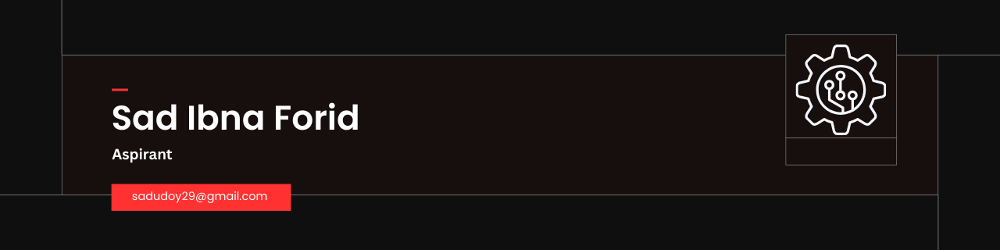

<h1 align="center">Hi, I'm Sad Ibna Forid </h1>

  Computer Science Student • Building Practical Software Projects

---

## About Me

Passionate about software engineering, problem-solving, and continuous technical improvement

I value **clean code, fundamentals, and continuous learning**.

---

## Socials

  
  
  
  
  

---

## Languages & Tools

  
  
   
  
  
 

  
  
  

---

## Currently Learning

- Software development fundamentals  
- Data structures & algorithms  
- Object-oriented programming  
- Digital Logic Design

---

  Focused on learning, building, and improving one step at a time.

